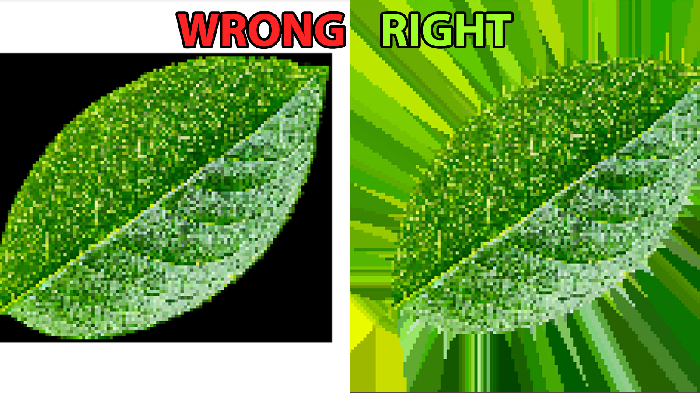

# Transparent-Padder
Contains a tool to correctly pad a transparent texture for use in game engines 

Transparent textures sometimes have garbage unrelated RGB values in the areas that transparent. In game engines this can lead to visual artifacts whereever the shader has to sample and average based on neighbouring pixels of a opaque pixel. An example is mips. The code here takes a png with transparency and generates a TGA with actual alpha, wher the RGB values surronding the opaque pixels are correctly padded. You can also use it to generally pad between UV islands of a normal texture. The texture is saved next to whatever image you provided.

Note: The larger the image, the longer it takes, give it time.
You can read more here: https://medium.com/@shahriyarshahrabi/padding-transparent-textures-fir-mips-and-game-engines-c71c085142fe

To get the .exe, go here (was made with pyinstaller): https://github.com/IRCSS/Transparent-Padder/releases/tag/v1

